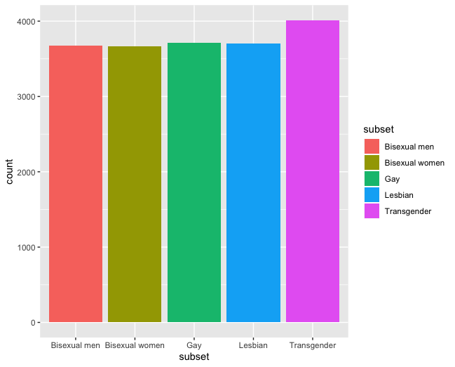
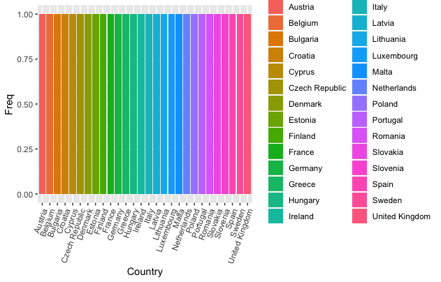
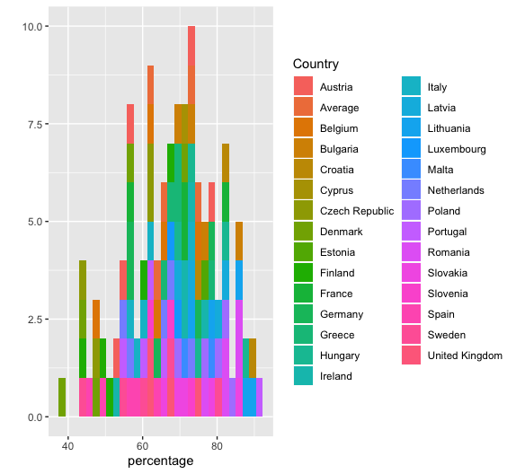
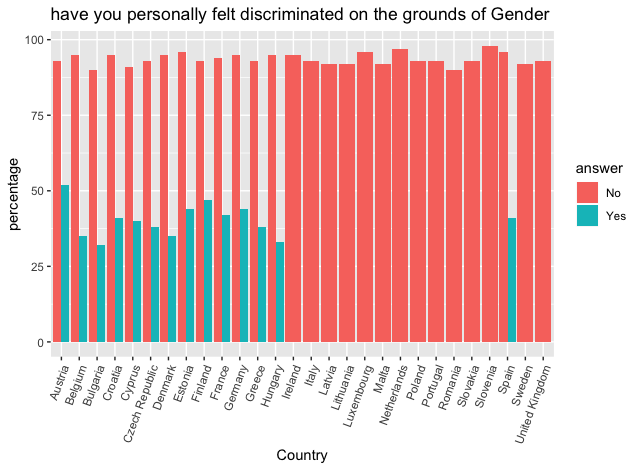
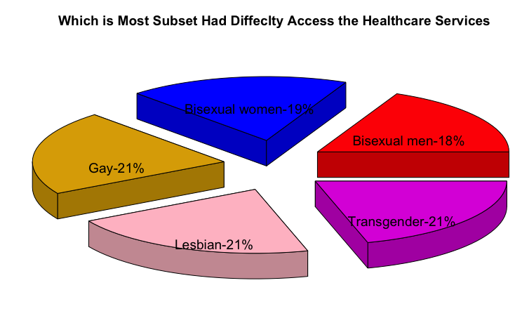
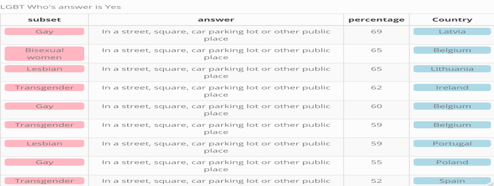
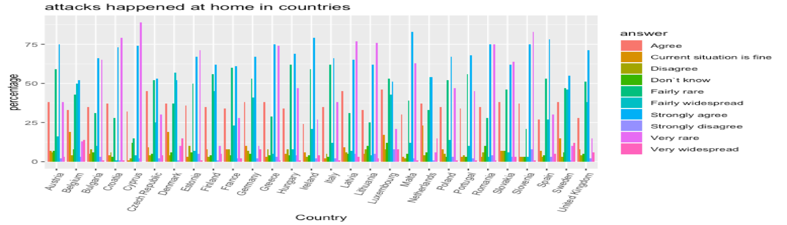

## Background

  FRA (fundamental rights agency) conducted an online survey to identify how
  lesbian, gay, bisexual and transgender (LGBT) people living in the European
  union and Croatia experience the fulfilment of their fundamental rights. the
  evidence produced by the survey will support the development of more effective
  laws and policies to fight discrimination, violence and harassment, improving
  equal treatment across society.

## About the data:
  Data is about a survey asked to lesbian, gay, bisexual and transgender (LGBT) people whether they had experienced discrimination, violence, verbal abuse or hate speech on the grounds of their sexual orientation or gender identity. The results reflect the experiences of more than 93,000 individuals who completed the online survey across Europe.

## Goal:
  To conduct exploratory analysis that find insights for better recommendation decision making and improve equality. 

## Technology Used for Analysis :
  R progrmaming, GGplot

## Analysis :
 **What are the LGBT groups and their counts**

  **LGBT community Distribution over each country**

**Which Country LGBT  community avoid begin open about themselves**

  **Which Country LGBT  community avoid begin open about themselves**

  **What percentage of LGBT community had sexual attack or threat of violence at home**

  **Felt discrimination on ground of gender ? Yes/No**

  **Which subset has more difficulty accessing the healthcare services**

**Where did the last incident of physical /sexual attack or threat of         violence happen in last 12 month**

**which country less supported LGBT community by public figures in politics, business,? Is that would help if it otherwise**

## Conclusion:

The Most LGBT friendly country is Czech Republic
Transgender sample is bit higher however, they are not the most felt discriminated moreover accessing  healthcare service was equally difficult for Lesbian ,Gay too with all 21% each.
Czech Republic ,Finland and Ireland are countries which where most the sexual attack , or threat of violence happens at  Homes .
sexual in public and home for both Ireland and Finland are both higher however Czech Republic is almost the same
Latvia is has the lowest sexual attack , or threat of violence domestically and the highest when it comes to public
60 to 80% of LGBT are avoid begin open about themselves specially in public transportation
Cypress had 0 support for LGBT specially by public figures in politics ,sport and so on
