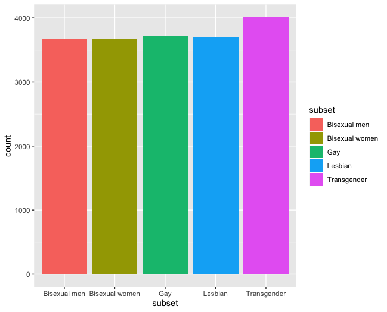
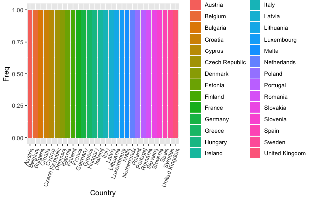
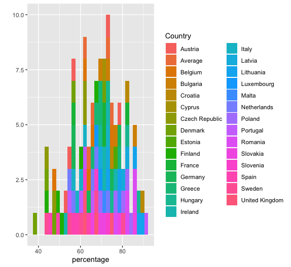
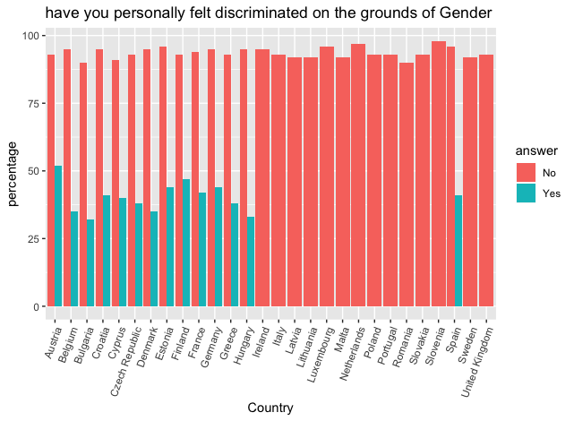
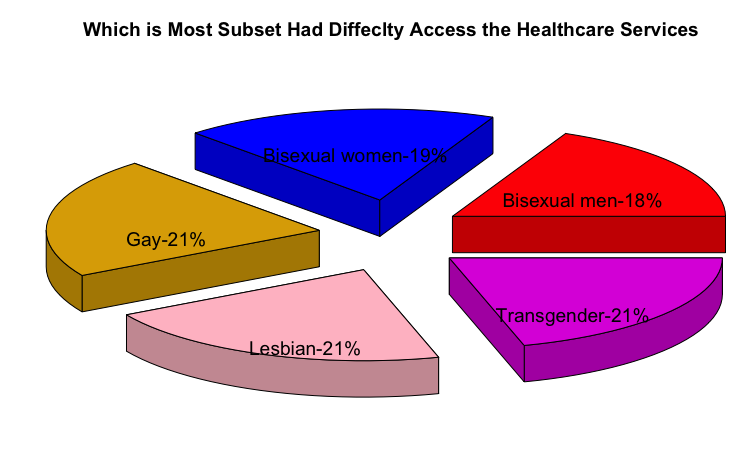
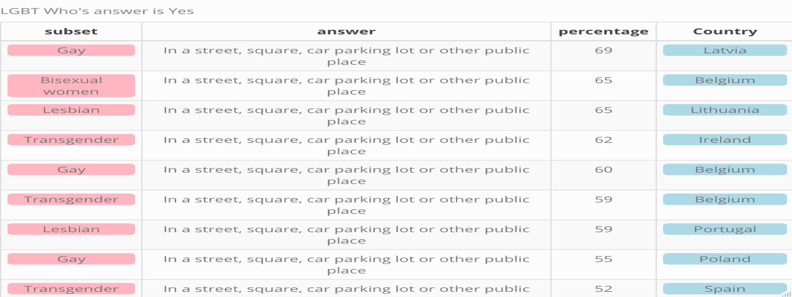
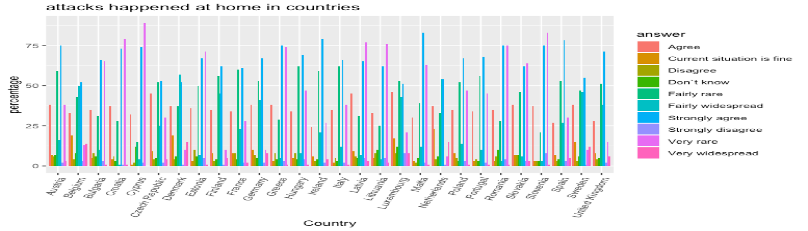
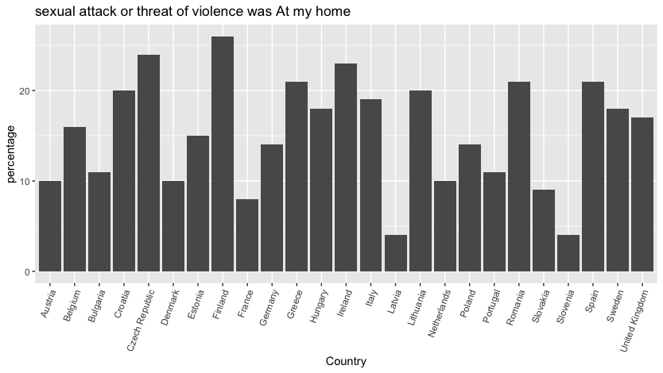

# LGBT Discrimination in Europe Analysis

## Background

FRA (Fundamental Rights Agency) conducted an online survey to identify how lesbian, gay, bisexual, and transgender (LGBT) people living in the European Union and Croatia experience the fulfillment of their fundamental rights. The evidence produced by the survey supports the development of more effective laws and policies to fight discrimination, violence, and harassment, improving equal treatment across society.

## About the Data
Data is based on a survey asking LGBT individuals whether they had experienced discrimination, violence, verbal abuse, or hate speech on the grounds of their sexual orientation or gender identity. The results reflect the experiences of more than 93,000 individuals who completed the online survey across Europe.

## Goal
To conduct exploratory analysis to uncover insights for better recommendation decision-making and improve equality.

---

## **Key Components**

### 1. **Data Preparation**
- Loaded and cleaned the dataset (`LGBT_ALL_1.csv`).
- Handled missing values and renamed columns for clarity.
- Filtered and selected relevant subsets of data for specific analyses.

### 2. **Exploratory Data Analysis (EDA)**
- **Demographic Distribution**: Analyzed the distribution of respondents across countries and subsets (e.g., sexual orientation, gender identity).
- **Incident Locations**: Identified common locations where physical or sexual attacks occurred, such as at home or in public places.
- **Discrimination Experiences**: Assessed the prevalence of discrimination or harassment based on sexual orientation and gender across various countries.
- **Healthcare Access**: Investigated difficulties faced by LGBT individuals when accessing healthcare services.

### 3. **Visualizations**
- Created bar charts and pie charts using `ggplot2` to illustrate findings, such as the percentage of individuals experiencing discrimination in different settings.
- Generated visual comparisons across countries and subsets.

### 4. **Statistical Analysis**
- Performed group-wise summaries to understand response distributions.
- Calculated percentages to highlight the extent of reported discrimination and harassment.

---

## **Technical Skills Demonstrated**

- **Data Manipulation**: Utilized R packages (`dplyr`, `tidyverse`, `sqldf`) for data wrangling and SQL-like operations.
- **Visualization**: Created detailed visualizations with `ggplot2` and `plotrix`.
- **Statistical Analysis**: Conducted descriptive statistics and group-wise analyses to extract meaningful insights.
- **Reporting**: Compiled findings into comprehensive reports and presentations (`LGBT Analysis Report.docx`, `Presentation1.pptx`).

---

## Analysis

### Visualizations

**1. What are the LGBT groups and their counts**

**2. LGBT Community Distribution Over Each Country**

**3. Which Country's LGBT Community Avoid Being Open About Themselves**

**4. Felt Discrimination on the Grounds of Gender (Yes/No)**

**5. Which Subset Has More Difficulty Accessing Healthcare Services**

**6. Where Did the Last Incident of Physical/Sexual Attack or Threat of Violence Happen in the Last 12 Months**

**7. Which Country Least Supported the LGBT Community by Public Figures in Politics, Business, Etc.?**

**8. What Percentage of the LGBT Community Had Sexual Attacks or Threats of Violence at Home**

---

## **Recommendations for Improvement**

### Insights
- The most LGBT-friendly country is the Czech Republic; however, it paradoxically has the second-highest rate of threats and attacks in domestic homes.
- Transgender sample is slightly higher; however, they are not the most discriminated group. Accessing healthcare services was equally difficult for lesbians and gays, both at 21%.
- Czech Republic, Finland, and Ireland reported most sexual attacks or threats of violence happening at homes.
- Sexual attacks in public and at home are higher in Ireland and Finland but are nearly the same in the Czech Republic.
- Latvia has the lowest rates of domestic sexual attacks but the highest for public ones.
- 60-80% of LGBT individuals avoid being open about themselves, especially in public transportation.
- Cyprus reported zero support for LGBT individuals, particularly from public figures in politics, sports, etc.

---

## **Conclusion**
This project highlights the power of data analysis in addressing significant social issues. It reflects technical proficiency, analytical rigor, and a dedication to using data for meaningful impact.
